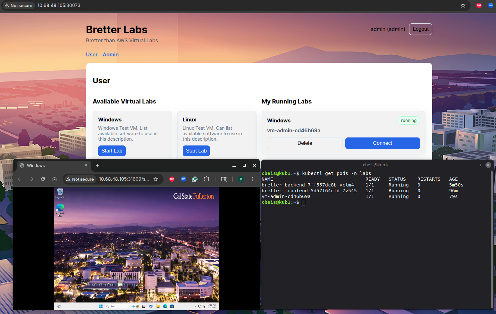
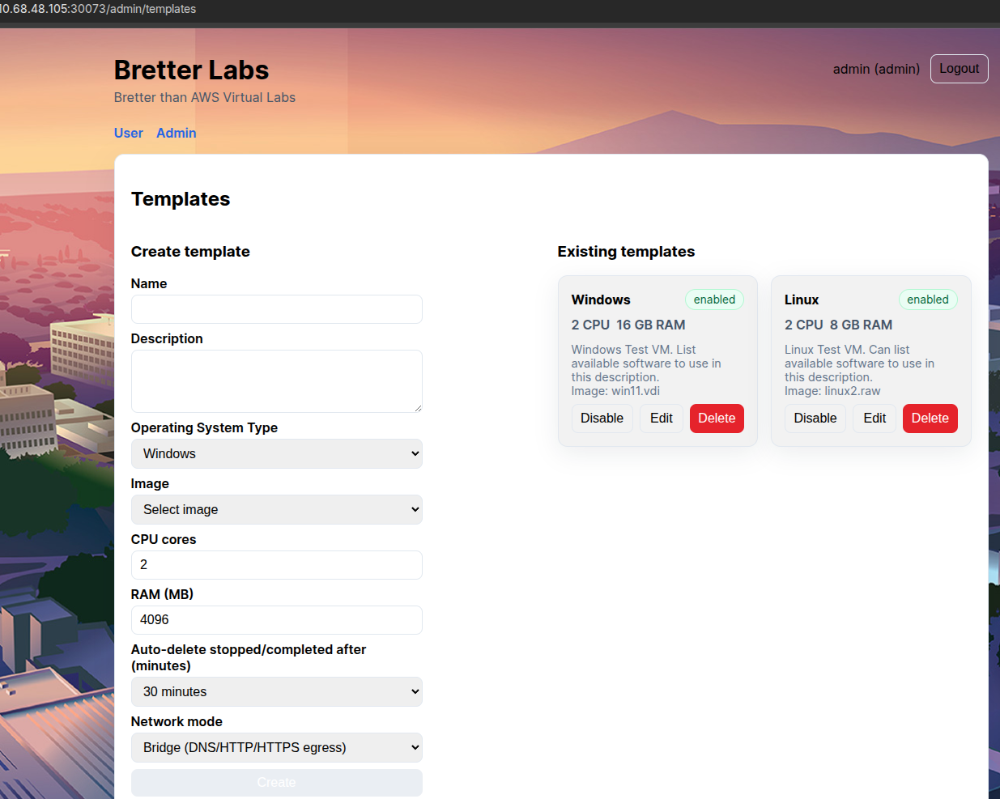
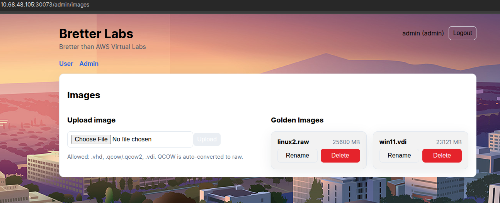
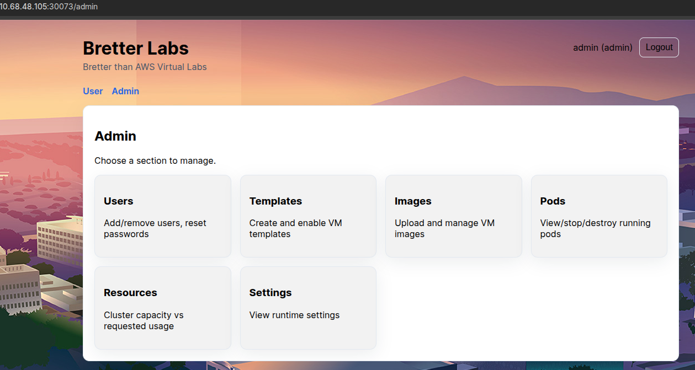
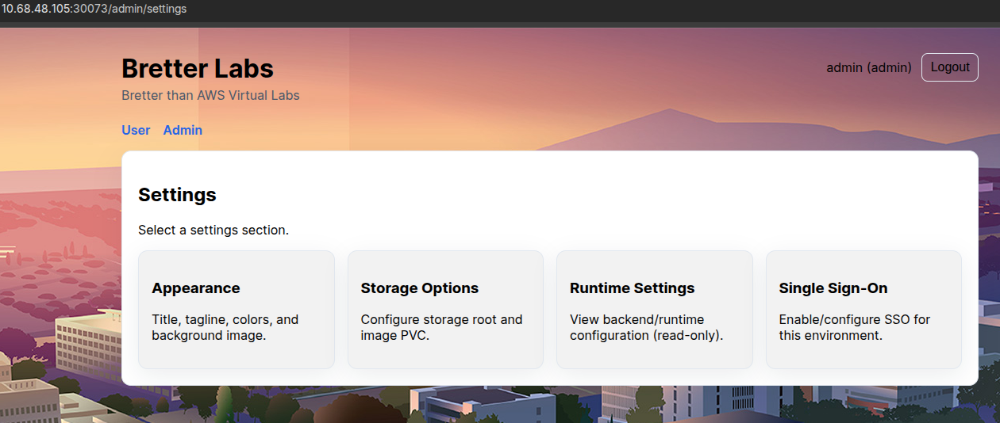
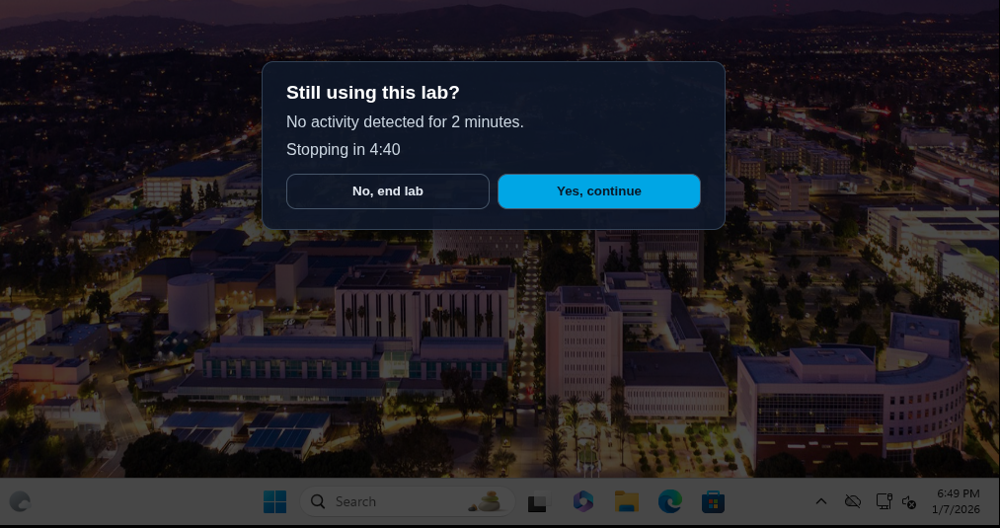

# Bretter Labs

## Description
Bretter Labs is a FastAPI + React (Vite) app for managing Windows/Linux lab VMs on Kubernetes. Admins upload images, define templates, enable/disable labs, manage users, and view cluster resources. Users start labs from templates and connect via SPICE directly in the browser.

## Installation

### Prerequisites
- Python 3.11+ with venv/pip (backend)
- Node.js 18+ with npm (frontend)
- kubectl (to talk to the target cluster)
- docker or podman (optional, for building/pushing images)

### Local development
Backend:
```bash
python3 -m venv .venv
. .venv/bin/activate
pip install -r backend/requirements.txt
uvicorn backend.src.main:app --host 0.0.0.0 --port 8000
```

Frontend:
```bash
cd frontend-vite
npm install
npm run dev -- --host --port 5173
```

### Kubernetes deployment (current setup)
Recommended: use the setup script (auto-installs prerequisites on Ubuntu/Debian).
```bash
./scripts/setup.sh
```

Optional flags:
- `PUSH_IMAGES=1` to build/push images (requires GHCR credentials).
- `CREATE_PULL_SECRET=1` to create `ghcr-creds` for private image pulls.
- `BACKEND_IMAGE` / `FRONTEND_IMAGE` to override image tags.
- `NAMESPACE` to override the namespace (default `labs`).
- `KUBECONFIG` to point at a specific kubeconfig.
- `APPLY_GOLDEN_PVC=1` to apply `deploy/golden-pvc.yaml`.

If you use prebuilt public images, you can skip GHCR entirely (leave `PUSH_IMAGES=0` and `CREATE_PULL_SECRET=0`).

Manual build/push (edit tags as needed):
```bash
podman build -t ghcr.io/csufpsudocromis/bretter-backend:latest -f backend/Dockerfile .
podman push ghcr.io/csufpsudocromis/bretter-backend:latest
podman build -t ghcr.io/csufpsudocromis/bretter-frontend:latest -f frontend-vite/Dockerfile .
podman push ghcr.io/csufpsudocromis/bretter-frontend:latest
```

Apply manifests:
```bash
kubectl --kubeconfig /etc/kubernetes/admin.conf apply -f deploy/app.yaml
```

Storage and runtime notes:
- `golden-images` PVC stores VM images. Create RWX PVC if needed: `kubectl apply -f deploy/golden-pvc.yaml`.
- Backend DB uses `backend-data` (hostPath `/home/cbeis/backend-data` on kub1).
- Runner image `ghcr.io/csufpsudocromis/win-vm-runner:latest` must be available to containerd on the node(s).

## Usage
- UI: NodePort `30073` (e.g. `http://<node-external-host>:30073`).
- API: NodePort `30080` (e.g. `http://<node-external-host>:30080`).
- Default admin: `admin` / `admin` (forced change on first login).

Admin workflow:
- Upload images and create templates (CPU/RAM, idle timeout, enable/disable).
- Manage users, pods, and cluster resources.

User workflow:
- Start a lab from a template.
- Connect via browser SPICE.
- Idle prompts appear in the UI and console; if ignored, labs are auto-stopped/removed.

## License
MIT License. See `LICENSE`.

## Screenshots






