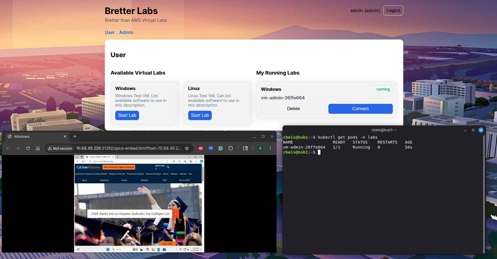

# Bretter Labs

FastAPI + React app for managing Windows/Linux lab VMs on Kubernetes. Admins upload images, define templates, enable/disable labs, manage users, and view cluster resources. Users start labs from templates and connect via SPICE in the browser.



## Prerequisites
- Python 3.11+ with venv/pip (backend)
- Node.js 18+ with npm (frontend)
- kubectl (to talk to the target cluster)

> Local dev (optional): create a venv, `pip install -r backend/requirements.txt`, and run `uvicorn backend.src.main:app --host 0.0.0.0 --port 8000`; for the UI `npm install && npm run dev -- --host --port 5173`. For production, use the Kubernetes flow below.

## Run everything in Kubernetes (current setup)
- Builds live in `backend/Dockerfile` and `frontend-vite/Dockerfile`. Images are pushed to GHCR and referenced directly by the manifests:
  ```bash
  podman build -t ghcr.io/csufpsudocromis/bretter-backend:latest -f backend/Dockerfile .
  podman push ghcr.io/csufpsudocromis/bretter-backend:latest
  podman build -t ghcr.io/csufpsudocromis/bretter-frontend:latest -f frontend-vite/Dockerfile .
  podman push ghcr.io/csufpsudocromis/bretter-frontend:latest
  ```
- Deploy manifests: `kubectl --kubeconfig /etc/kubernetes/admin.conf apply -f deploy/app.yaml`
  - Backend Deployment uses ServiceAccount `bretter-backend` with RBAC to create pods/svcs/PVCs.
  - NodePorts: backend `30080` (health `/health`), frontend `30073`.
  - Node selector pins both to `kub1`.
  - PVCs: `golden-images` for VM images, `backend-data` (hostPath `/home/cbeis/backend-data` on kub1) for SQLite DB.
- Runner image: `ghcr.io/csufpsudocromis/win-vm-runner:latest` is imported into containerd on kub1; pods are also pinned to kub1 to use it.
- Access: http://10.68.48.105:30073 (UI) → API at http://10.68.48.105:30080.
- Idle handling: users get an inactivity prompt after template-configured idle minutes (default 30); if unanswered, a 5-minute countdown stops their running labs.

### UI highlights
- **User**: tiles for templates (name/description/specs), start lab, view running labs with status, connect (opens SPICE embed), delete.
- **Admin**:
  - Templates: create with description/image/CPU/RAM, enable/disable, edit, delete.
  - Images: upload/manage VM images (.vhd/.qcow/.qcow2/.vdi; uploads and deletes sync to the PVC automatically).
  - Users: create, edit (username/password/role), delete.
  - Pods: list/stop/delete running pods.
  - Resources: view cluster capacity/allocatable vs requested CPU/memory.

## Golden image storage (RWX)
- Create a ReadWriteMany PVC for images (works on any node): `kubectl apply -f deploy/golden-pvc.yaml` and set `storageClassName` to your RWX class (NFS/CSI/Longhorn/etc.).
- Point the backend to that PVC via `BLABS_KUBE_IMAGE_PVC=golden-images`. All uploads go straight to the PVC; Admin → Images lists files from it; renames delete/rename on the PVC.
- When a user launches a VM, the image is copied into the pod’s emptyDir so the golden image stays unchanged.

## Kubernetes expectations
- Namespace defaults to `labs`; PVC `golden-images` must exist.
- KVM passthrough is supported (`/dev/kvm` hostPath, privileged runner) when `BLABS_KUBE_USE_KVM=true`.
- Runner image set via `BLABS_RUNNER_IMAGE`; current: `ghcr.io/csufpsudocromis/win-vm-runner:latest` imported locally.
- Idle timeout default set via `BLABS_IDLE_TIMEOUT_MINUTES` (default 30). Per-template overrides are available in Admin → Templates.

## Screenshots


