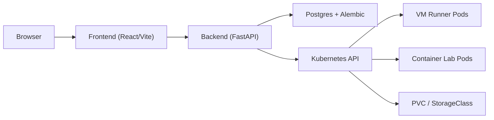
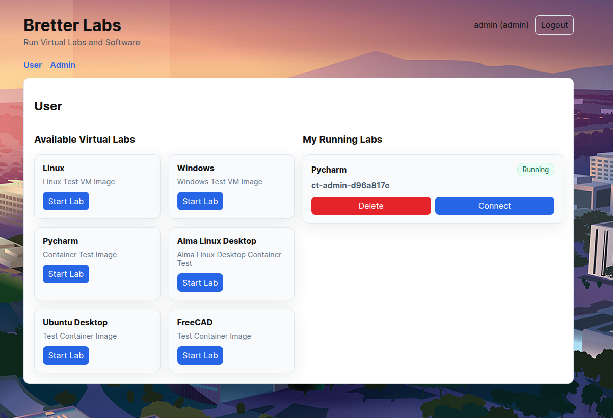
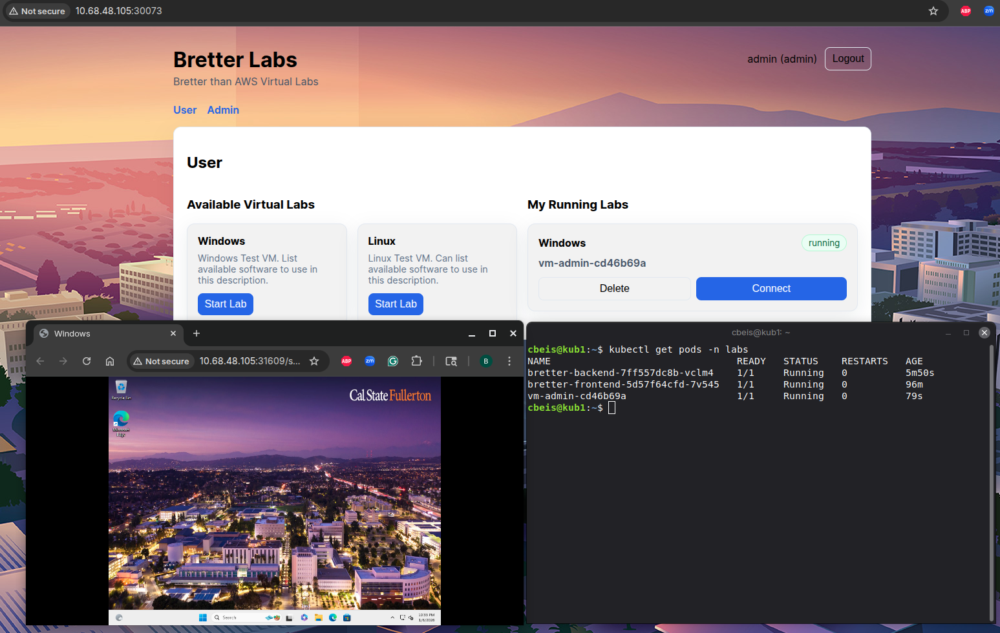

# Bretter Labs

[](LICENSE)
[](https://kubernetes.io/)

Bretter Labs is a Kubernetes-native virtual lab platform for browser-based VM and container labs.

Admins manage images, templates, users, runtime/storage settings, and platform health.  
Users launch labs with staged status feedback and connect in the browser.

## Table of Contents

- [Prove It Fast](#prove-it-fast)
- [What You Get](#what-you-get)
- [Supported VM Image Types](#supported-vm-image-types)
- [Architecture](#architecture)
- [Operator/CRD Migration](#operatorcrd-migration)
- [Quick Start](#quick-start)
- [Production Checks at a Glance](#production-checks-at-a-glance)
- [Key Setup Variables](#key-setup-variables)
- [Security and Session Model](#security-and-session-model)
- [Admin and User Workflows](#admin-and-user-workflows)
- [Local Development](#local-development)
- [Release and Versioning](#release-and-versioning)
- [Operations](#operations)
- [Container Packages](#container-packages)
- [Contributing](#contributing)
- [Security Policy](#security-policy)
- [Community and Roadmap](#community-and-roadmap)
- [Documentation and Wiki](#documentation-and-wiki)
- [Project Structure](#project-structure)
- [License](#license)

## Prove It Fast

### Try it in 5 minutes

```bash
git clone https://github.com/csufpsudocromis/bretter-labs.git
cd bretter-labs
./scripts/setup.sh
```

Then open `https://<NODE_EXTERNAL_HOST>:30073` and sign in with the bootstrap admin credentials printed by setup.

### Architecture at a glance


```mermaid
flowchart LR
  Browser --> Frontend["Frontend (React/Vite)"]
  Frontend --> Backend["Backend (FastAPI)"]
  Backend --> Postgres["Postgres + Alembic"]
  Backend --> K8s["Kubernetes API"]
  K8s --> VM["VM Runner Pods"]
  K8s --> CT["Container Lab Pods"]
  K8s --> PVC["PVC / StorageClass"]
```

### What it looks like


_Admin view: image/template operations, runtime controls, and health._


_User view: launch feedback and in-browser connect workflow._

### 60-second walkthrough

- Publish a short demo video/GIF and link it here for first-time evaluators.
- Suggested location: GitHub Discussions "Show and Tell" thread.

## What You Get

### Admin features

- VM image upload and normalization
- VM templates and container templates
- Per-template VM console provider selection (`spice`, `guacamole`/VNC, or `guacamole_rdp`)
- Container image registry management
- Runtime, storage, appearance, and alert/error settings
- Resource, pod, and health visibility in admin pages

### User features

- Launch labs from enabled VM and container templates
- Staged runtime feedback (for example: Pending, Building, Starting, Running)
- Browser connect for VM and container labs
- Idle timeout behavior and cleanup automation
- Single active lab enforcement per user
- Clear start-limit feedback when a lab is already active

### Platform features

- FastAPI backend + React (Vite) frontend
- Kubernetes-native VM/container lifecycle orchestration
- Clone-based VM storage workflows
- CDI direct upload/finalization support
- Postgres-backed DB stack with Alembic migrations
- Backend/frontend HPA controls with CPU-based autoscaling thresholds
- Monitoring hooks, alert ingestion, and capped error logs
- Secure session cookie auth with short-lived connect access flow

## Supported VM Image Types

Allowed upload formats:

- `.vhd`
- `.vhdx`
- `.qcow`
- `.qcow2`
- `.vdi`

QCOW uploads are normalized to raw during finalization.

## Architecture

Core components:

- [frontend-vite/](frontend-vite/): UI for admin and user workflows
- [backend/](backend/): API, auth/session, orchestration, migrations
- [runner/](runner/): VM runtime image (QEMU with SPICE, Guacamole VNC, or Guacamole RDP console modes)
- [deploy/helm/](deploy/helm/): Helm chart and production values used by setup
- [scripts/setup.sh](scripts/setup.sh): bootstrap, deploy (Helm), and tuning automation

High-level flow:

1. Admin uploads image(s) and publishes template(s).
2. User starts a VM or container lab.
3. Backend provisions per-instance Kubernetes resources.
4. User connects from browser through the platform connect flow.

## Operator/CRD Migration

The platform is moving from backend-imperative orchestration toward Kubernetes-native reconciliation.

- Migration blueprint: [docs/operator-crd-migration-plan.md](docs/operator-crd-migration-plan.md)
- Initial CRD definitions: [deploy/crds/](deploy/crds/)
- Operator deployment/alerts manifests: [deploy/operator/](deploy/operator/)

Current status: `v1alpha1` CRDs are checked in for phased rollout (`LabInstance`, `LabImageImport`), with staged cutover documented in the migration plan.

Migration helper commands:

```bash
# apply CRDs + operator manifests
kubectl apply -k deploy/crds
kubectl apply -k deploy/operator

# backfill active DB instances into LabInstance CRDs
.venv/bin/python scripts/backfill_labinstances_from_db.py --dry-run
.venv/bin/python scripts/backfill_labinstances_from_db.py

# canary lifecycle check (requires controller + valid template id)
NAMESPACE=labs CRD_CANARY_TEMPLATE_ID=<template-id> ./scripts/crd_canary_labinstance.sh
```

## Quick Start

### Prerequisites

- Kubernetes cluster access
- `kubectl` configured for target cluster
- Linux host with Bash (Ubuntu/Debian recommended)

### Deploy

```bash
git clone https://github.com/csufpsudocromis/bretter-labs.git
cd bretter-labs
./scripts/setup.sh
```

### Access

- UI: `https://<NODE_EXTERNAL_HOST>:30073`
- API (via frontend reverse proxy): `https://<NODE_EXTERNAL_HOST>:30073/api`
- Optional direct API NodePort (dev-only): set `BACKEND_NODEPORT_ENABLED=1`

Bootstrap admin account:

- username: `admin`
- password: one-time bootstrap secret (randomly generated by `./scripts/setup.sh` unless `ADMIN_BOOTSTRAP_PASSWORD` is set)

Password change is required on first login.
When setup generates the secret, it is written to `~/.config/bretter-labs/bootstrap-admin-<timestamp>.txt` with mode `600`.
If no admin user exists and no bootstrap secret is configured, backend startup fails fast.
After first login/reset, keep the bootstrap file in secure storage and verify `BLABS_ADMIN_DEFAULT_PASSWORD` has been pruned from the backend deployment.

## Production Checks at a Glance

Use this flow for repeatable production rollouts:

```bash
# 1) create/update your site overlay (cluster-specific values + secret wiring names)
cp deploy/helm/values-production-site.template.yaml deploy/helm/values-prod-site.yaml

# 2) validate hardened baseline + your site overlay
python3 scripts/validate_production_profile.py --strict \
  -f deploy/helm/values-production.yaml \
  -f deploy/helm/values-prod-site.yaml

# 3) run deploy preflight (strict merged values + required cluster secrets + per-node image pull smoke)
NAMESPACE=labs ./scripts/deploy_preflight.sh

# 4) ensure post-deploy auth + RDP SLO probe auth secrets exist in cluster
kubectl -n labs create secret generic bretter-postdeploy-auth \
  --from-literal=admin_username='admin' \
  --from-literal=admin_password='<admin-password>' \
  --from-literal=synthetic_username='admin' \
  --from-literal=synthetic_password='<admin-password>' \
  --dry-run=client -o yaml | kubectl apply -f -
kubectl -n labs create secret generic bretter-userflow-slo-api-auth \
  --from-literal=username='admin' \
  --from-literal=password='<rdp-probe-password>' \
  --dry-run=client -o yaml | kubectl apply -f -

# 5) run repository guardrails (includes strict production profile validation + preflight static mode)
./scripts/ci_guardrails.sh

# 6) deploy with production profile; postdeploy runs go-live proof by default
PRODUCTION_PROFILE=1 SETUP_PHASES=deploy,postdeploy ./scripts/setup.sh
```

Proof artifact and operator docs:

- Go-live proof script: [scripts/production_go_live_proof.sh](scripts/production_go_live_proof.sh)
- Postgres restore drill: [scripts/restore_drill_postgres.sh](scripts/restore_drill_postgres.sh)
- CRD canary script: [scripts/crd_canary_labinstance.sh](scripts/crd_canary_labinstance.sh)
- LabImageImport controller smoke: [scripts/smoke_labimageimport_controller.sh](scripts/smoke_labimageimport_controller.sh)
- Pre-deploy script: [scripts/deploy_preflight.sh](scripts/deploy_preflight.sh)
- Userflow smoke workflow: [.github/workflows/deploy-userflow-smoke.yml](.github/workflows/deploy-userflow-smoke.yml)
- Post-deploy synthetic workflow: [.github/workflows/post-deploy-synthetic.yml](.github/workflows/post-deploy-synthetic.yml)
- Nightly restore drill workflow: [.github/workflows/nightly-restore-drill.yml](.github/workflows/nightly-restore-drill.yml)
- Playwright Guacamole RDP smoke workflow: [.github/workflows/playwright-rdp-smoke.yml](.github/workflows/playwright-rdp-smoke.yml)
- Default report dir: [artifacts/go-live/](artifacts/go-live/)
- Production values reference: [docs/wiki/Production-Helm-Values-Reference.md](docs/wiki/Production-Helm-Values-Reference.md)
- Secret operations: [docs/wiki/Secret-Operations-Runbook.md](docs/wiki/Secret-Operations-Runbook.md)
- Alert routing defaults: [docs/wiki/Alert-Routing-and-Receiver-Defaults.md](docs/wiki/Alert-Routing-and-Receiver-Defaults.md)
- Post-deploy validation SOP: [docs/wiki/Post-Deploy-Validation-SOP.md](docs/wiki/Post-Deploy-Validation-SOP.md)
- Console and RDP operations: [docs/wiki/Console-Providers-and-RDP-Operations.md](docs/wiki/Console-Providers-and-RDP-Operations.md)
- Operator incident runbook: [docs/wiki/Operator-Incident-Runbook.md](docs/wiki/Operator-Incident-Runbook.md)
- GitHub release/packages runbook: [docs/wiki/GitHub-Release-and-Packages-Operations.md](docs/wiki/GitHub-Release-and-Packages-Operations.md)

## Key Setup Variables

| Variable | Default | Purpose |
| --- | --- | --- |
| `NAMESPACE` | `labs` | Target namespace |
| `CONTROL_NODE` | auto | Preferred control node for pinned workloads |
| `NODE_EXTERNAL_HOST` | auto | Public host/IP used in generated URLs |
| `PUBLIC_SCHEME` | `https` | Public URL scheme |
| `PRODUCTION_PROFILE` | `0` | Enables backend startup hardening checks (set `1` for production) |
| `ORCHESTRATION_BACKEND` | `db` | VM orchestration mode: `db` (legacy), `dual` (legacy + LabInstance CRD shadow write), `crd` (LabInstance CRD-first) |
| `IMAGE_IMPORT_BACKEND` | `crd` | Image import tracking mode: `db`, `dual` (DB + LabImageImport shadow), `crd` |
| `LABIMAGEIMPORT_CONTROLLER_ENABLED` | `1` | Enable dedicated LabImageImport reconcile controller when image-import backend is `dual`/`crd` |
| `LABIMAGEIMPORT_CONTROLLER_LEADER_ELECTION_ENABLED` | `1` | Enable lease-based HA leader election for image-import controller |
| `LABIMAGEIMPORT_CONTROLLER_LEASE_NAME` | `bretter-labimageimport-controller-leader` | Coordination lease name used by image-import controller |
| `LABIMAGEIMPORT_CONTROLLER_POLL_SECONDS` | `10` | Reconcile interval for upload-task watchdog controller loop |
| `LABIMAGEIMPORT_CONTROLLER_METRICS_PORT` | `9410` | Metrics/liveness/readiness port for image-import controller |
| `TEAM_NAMESPACE_MODE` | `shared` | Runtime namespace model (`shared` or `per_team`); production hardening requires `per_team` (namespace-first isolation) |
| `TEAM_NAMESPACE_PREFIX` | `labs-team-` | Namespace prefix used by per-team namespace scaffolding |
| `REQUIRE_SCHEMA_READY` | `1` | Fail backend startup if Alembic head/table state is not fully ready |
| `EXPECTED_ALEMBIC_REVISION` | empty | Optional explicit Alembic revision id expected at startup |
| `TLS_ENABLED` | `1` | Enable TLS secret/bootstrap behavior |
| `ADMIN_BOOTSTRAP_PASSWORD` | random | Initial one-time admin secret used only when no admin user exists (required for first bootstrap path) |
| `VM_STORAGE_CLASS` | auto | StorageClass for VM clone disks |
| `BACKEND_NODEPORT_ENABLED` | `0` | Expose backend API as NodePort (`30080`) only when explicitly enabled |
| `HELM_RELEASE_NAME` | `bretter-labs` | Helm release name for base app deploy |
| `HELM_CHART_DIR` | `deploy/helm` | Chart path used by setup for base deploy |
| `EXTERNAL_SECRETS_CHART_VERSION` | `v2.1.0` | External Secrets Helm chart version when operator install is enabled |
| `MONITORING_CHART_VERSION` | `v82.10.4` | `kube-prometheus-stack` chart version |
| `KYVERNO_CHART_VERSION` | `v3.7.1` | Kyverno chart version |
| `APPLY_GOLDEN_HOSTPATH` | `1` | HostPath-backed golden image PVC |
| `APPLY_GOLDEN_PVC` | `0` | Use `deploy/golden-pvc.yaml` instead |
| `BACKEND_IMAGE` | `ghcr.io/csufpsudocromis/bretter-backend-runtime:v<VERSION>` | Backend runtime image reference (no kubectl/cosign/trivy binaries) |
| `BACKEND_ADMIN_IMAGE` | `ghcr.io/csufpsudocromis/bretter-backend:v<VERSION>` | Backend admin-tools image for ops jobs (cleanup/signature scan helpers) |
| `FRONTEND_IMAGE` | `ghcr.io/csufpsudocromis/bretter-frontend:v<VERSION>` | Frontend image reference |
| `RUNNER_IMAGE` | `ghcr.io/csufpsudocromis/win-vm-runner:v<VERSION>` | Runner image reference |
| `BACKEND_REPLICAS` | `1` | Backend deployment replica count |
| `FRONTEND_REPLICAS` | `2` | Frontend deployment replica count |
| `BACKEND_HPA_MIN_REPLICAS` | `BACKEND_REPLICAS` | Backend HPA lower bound |
| `BACKEND_HPA_MAX_REPLICAS` | `BACKEND_REPLICAS` | Backend HPA upper bound |
| `BACKEND_HPA_TARGET_CPU_UTILIZATION_PERCENT` | `70` | Backend HPA CPU target percent |
| `FRONTEND_HPA_MIN_REPLICAS` | `FRONTEND_REPLICAS` | Frontend HPA lower bound |
| `FRONTEND_HPA_MAX_REPLICAS` | `FRONTEND_REPLICAS` | Frontend HPA upper bound |
| `FRONTEND_HPA_TARGET_CPU_UTILIZATION_PERCENT` | `70` | Frontend HPA CPU target percent |
| `UVICORN_WORKERS` | `1` | Uvicorn worker processes per backend pod |
| `LOAD_LOCAL_IMAGES` | `1` | Build/import local images into cluster runtime |
| `PUSH_IMAGES` | `0` | Build and push images to registry |
| `CREATE_PULL_SECRET` | `0` | Create/update `ghcr-creds` pull secret |
| `ALLOW_MUTABLE_IMAGE_TAGS` | `0` | Dev-only override to permit mutable image refs like `:latest` |
| `PRUNE_BOOTSTRAP_ADMIN_ENV` | `1` | Remove `BLABS_ADMIN_DEFAULT_PASSWORD` from backend deployment after initial bootstrap rollout |
| `SETUP_PHASES` | `prereqs,deploy,postdeploy` | Select setup phases (`prereqs`,`deploy`,`postdeploy`,`all`) |
| `SETUP_DRY_RUN` | `0` | Validate and print phase plan without running cluster/package actions |
| `CORS_ENTERPRISE_PROFILE` | `0` | Enforce explicit CORS allowlist mode (`1` recommended for prod) |
| `CORS_ALLOWED_ORIGINS` | empty | Comma-separated CORS origin allowlist (required when enterprise profile is enabled) |
| `AUTH_LOGIN_RATE_LIMIT_MAX_ATTEMPTS` | `5` | Failed login attempts allowed before temporary lockout |
| `AUTH_LOGIN_RATE_LIMIT_WINDOW_SECONDS` | `300` | Sliding window for failed-login counting |
| `AUTH_LOGIN_LOCKOUT_SECONDS` | `300` | Temporary lockout duration after too many failed attempts |
| `VM_CONNECT_INSECURE_TLS` | `0` | Dev-only opt-in to skip VM upstream TLS verification |
| `CONTAINER_CONNECT_INSECURE_TLS` | `0` | Dev-only opt-in to skip container upstream TLS verification |
| `SECRETS_ENCRYPTION_KEY` | empty | Optional bootstrap input for setup; when set, setup writes it into the runtime secret (`RUNTIME_SECRETS_SECRET_NAME`) and it is not committed in values files |
| `RUNTIME_SECRETS_SECRET_NAME` | `bretter-runtime-secrets` | Kubernetes secret name that provides `BLABS_SECRETS_ENCRYPTION_KEY` to backend |
| `RUNTIME_SECRETS_ENCRYPTION_KEY_KEY` | `secrets_encryption_key` | Data key inside `RUNTIME_SECRETS_SECRET_NAME` used for `BLABS_SECRETS_ENCRYPTION_KEY` |
| `CONTAINER_SIGNATURE_VERIFICATION_ENABLED` | `0` | Must be `1` when `PRODUCTION_PROFILE=1`; enforces cosign verification for container image registration/update |
| `CONTAINER_SIGNATURE_KEY_REF` | `/etc/bretter-signing/cosign.pub` | Cosign public key path used for verification in hardened profiles |
| `CONTAINER_SIGNATURE_KEY_SECRET_NAME` | `bretter-cosign-public-key` | Secret mounted at `/etc/bretter-signing` to provide the public key file referenced by `CONTAINER_SIGNATURE_KEY_REF` |
| `CONTAINER_SIGNATURE_PUBLIC_KEY` | empty | Optional setup input: inline cosign public key content used to create/update `CONTAINER_SIGNATURE_KEY_SECRET_NAME` |
| `CONTAINER_SIGNATURE_PUBLIC_KEY_FILE` | empty | Optional setup input: file path to a cosign public key used to create/update `CONTAINER_SIGNATURE_KEY_SECRET_NAME` |
| `KYVERNO_SIGNATURE_SCOPE` | `namespace_first_party` | Signature policy scope (`namespace_first_party` or `enforced_label`) |
| `KYVERNO_SIGNATURE_IMAGE_PATTERNS` | `ghcr.io/csufpsudocromis/*` | Comma-separated image reference patterns covered by Kyverno `verifyImages` |
| `KYVERNO_SIGNATURE_REGISTRY_SECRET_NAME` | `ghcr-creds` | Docker config secret used by Kyverno `verifyImages` for registry auth (synced into Kyverno namespace during policy apply) |
| `KYVERNO_SIGNATURE_REGISTRY_SECRET_SOURCE_NAMESPACE` | `NAMESPACE` | Source namespace for `KYVERNO_SIGNATURE_REGISTRY_SECRET_NAME` before setup syncs it into `KYVERNO_NAMESPACE` |
| `METRICS_SERVER_VERSION` | `v0.8.1` | Metrics-server release used to build default manifest URL |
| `METRICS_SERVER_INSECURE_TLS` | `0` | Dev-only opt-in for `--kubelet-insecure-tls` on metrics-server |
| `ENABLE_KUBELET_SERVING_CSR_AUTOAPPROVAL` | `1` | Auto-approve valid pending `kubernetes.io/kubelet-serving` CSRs |
| `KUBELET_SERVING_CSR_AUTOAPPROVAL_SCHEDULE` | `*/5 * * * *` | Cron schedule for kubelet-serving CSR auto-approver job |
| `RUN_POST_DEPLOY_RUNNER_SMOKE_CHECK` | `1` | Run runner image startup smoke check during postdeploy |
| `POST_DEPLOY_RUNNER_SMOKE_TIMEOUT_SECONDS` | `120` | Timeout budget for runner smoke pod readiness |
| `POST_DEPLOY_RUNNER_SMOKE_IMAGE_PULL_POLICY` | `IfNotPresent` | Pull policy used by runner smoke pod (`Always`/`IfNotPresent`/`Never`) |
| `ENABLE_POSTGRES_BACKUP_AUTOMATION` | `1` | Create/maintain a PostgreSQL backup CronJob and backup PVC |
| `POSTGRES_BACKUP_SCHEDULE` | `17 3 * * *` | Cron schedule for logical PostgreSQL backups |
| `POSTGRES_BACKUP_RETENTION_DAYS` | `7` | Retention window (days) for backup dump files |
| `POSTGRES_BACKUP_PVC_NAME` | `bretter-postgres-backups` | PVC name used by backup automation |
| `POSTGRES_BACKUP_PVC_SIZE` | `20Gi` | Backup PVC requested size |
| `ENABLE_POSTGRES_BACKUP_REPLICATION` | `0` | Enable encrypted off-cluster replication of latest backup dump to S3-compatible storage |
| `POSTGRES_BACKUP_REPLICATION_BUCKET` | empty | Target S3 bucket for backup replication |
| `POSTGRES_BACKUP_REPLICATION_SECRET_NAME` | `bretter-postgres-backup-replication` | Secret containing replication credentials (`aws_access_key_id`/`aws_secret_access_key`) |
| `POSTGRES_BACKUP_REPLICATION_SSE_MODE` | `AES256` | Server-side encryption mode for replicated backups (`AES256` or `aws:kms`) |
| `RUN_POST_DEPLOY_ADMIN_API_SMOKE_CHECK` | `1` | Run authenticated admin API smoke suite during postdeploy |
| `POST_DEPLOY_ADMIN_API_SMOKE_TIMEOUT_SECONDS` | `180` | Timeout budget for admin API smoke job |
| `ADMIN_API_SMOKE_USERNAME` | `admin` | Admin username used by postdeploy admin smoke validation |
| `ADMIN_API_SMOKE_PASSWORD` | empty | Admin password used by postdeploy admin smoke validation |
| `POST_DEPLOY_AUTH_SECRET_NAME` | empty | Optional secret-backed credential source for admin + synthetic post-deploy checks |
| `POST_DEPLOY_AUTH_ADMIN_PASSWORD_KEY` | `admin_password` | Password key inside `POST_DEPLOY_AUTH_SECRET_NAME` for admin API smoke |
| `POST_DEPLOY_AUTH_SYNTHETIC_PASSWORD_KEY` | `synthetic_password` | Password key inside `POST_DEPLOY_AUTH_SECRET_NAME` for synthetic check |
| `ENABLE_GHCR_ACCESS_HEALTHCHECK` | `1` | Deploy recurring GHCR registry access CronJob |
| `GHCR_ACCESS_HEALTHCHECK_SCHEDULE` | `*/10 * * * *` | Cron schedule for GHCR access checks |
| `GHCR_ACCESS_HEALTHCHECK_TIMEOUT_SECONDS` | `120` | Timeout budget for each GHCR access probe run |
| `ENABLE_USERFLOW_SLO_PROBES` | `1` | Deploy recurring VM/RDP/upload SLO probe CronJobs |
| `USERFLOW_SLO_PROBE_SCHEDULE` | `*/10 * * * *` | Cron schedule for user-flow SLO probes |
| `USERFLOW_SLO_LOOKBACK_MINUTES` | `30` | Lookback window for SLO rate checks |
| `USERFLOW_SLO_VM_LAUNCH_FAILURE_RATE_PCT` | `25` | VM launch failure-rate threshold for SLO breach |
| `USERFLOW_SLO_UPLOAD_FINALIZE_FAILURE_RATE_PCT` | `25` | Upload finalize failure-rate threshold for SLO breach |
| `USERFLOW_SLO_RDP_STUCK_MINUTES` | `12` | Age threshold before RDP-starting instances are considered stuck |
| `USERFLOW_SLO_RDP_STUCK_MAX` | `2` | Max allowed stuck RDP instances before SLO breach |
| `USERFLOW_SLO_RDP_FAILURE_RATE_PCT` | `25` | RDP readiness probe failure-rate threshold used by burn-rate alerts |
| `USERFLOW_SLO_IMAGE_IMPORT_QUEUE_MAX_AGE_MINUTES` | `30` | Max age for oldest in-progress image import before queue-age probe fails |
| `USERFLOW_SLO_IMAGE_IMPORT_QUEUE_FAILURE_RATE_PCT` | `20` | Queue-age probe failure-rate threshold used by burn-rate alerts |
| `ENABLE_USERFLOW_SLO_RDP_CONNECT_LATENCY_PROBE` | `0` | Enable authenticated RDP connect-latency probe CronJob |
| `USERFLOW_SLO_RDP_CONNECT_LATENCY_SECONDS` | `20` | RDP connect-latency SLO threshold in seconds |
| `USERFLOW_SLO_RDP_CONNECT_FAILURE_RATE_PCT` | `25` | RDP connect-latency probe failure-rate threshold used by burn-rate alerts |
| `USERFLOW_SLO_API_BASE` | empty | Optional API base override for authenticated SLO probes (default internal backend service URL) |
| `USERFLOW_SLO_API_VERIFY_TLS` | auto | Optional TLS verify override for authenticated SLO probes (`0`/`1`) |
| `USERFLOW_SLO_API_USERNAME` | `admin` | Username used by authenticated RDP connect-latency probe |
| `USERFLOW_SLO_API_PASSWORD` | empty | Password used by authenticated RDP connect-latency probe |
| `USERFLOW_SLO_API_AUTH_SECRET_NAME` | `bretter-userflow-slo-api-auth` | Secret name used by RDP connect-latency probe auth |
| `USERFLOW_SLO_API_AUTH_USERNAME_KEY` | `username` | Username key in RDP probe auth secret |
| `USERFLOW_SLO_API_AUTH_PASSWORD_KEY` | `password` | Password key in RDP probe auth secret |
| `USERFLOW_SLO_API_AUTH_MANAGED_BY_SETUP` | `1` | `1`: setup can bootstrap auth secret from env credentials, `0`: require pre-provisioned secret (recommended for production) |
| `ALERTMANAGER_WEBHOOK_RECEIVER_ENABLED` | `0` | Enable Alertmanager webhook receiver routing in setup-managed monitoring values |
| `ALERTMANAGER_WEBHOOK_SECRET_NAME` | empty | Secret name containing webhook URL used when webhook receiver is enabled |
| `RUN_PRODUCTION_GO_LIVE_PROOF` | `PRODUCTION_PROFILE` | Run `scripts/production_go_live_proof.sh` automatically during `postdeploy` when enabled |
| `PRODUCTION_GO_LIVE_REPORT_DIR` | `artifacts/go-live` | Output directory for go-live proof reports |
| `PRODUCTION_GO_LIVE_HEALTH_TIMEOUT_SECONDS` | `120` | API health timeout budget for go-live proof |
| `RUN_RESTORE_DRILL` | `0` | Optional: run PostgreSQL restore drill as part of go-live proof |
| `RESTORE_DRILL_KEEP_DB` | `0` | Optional: keep restored drill database for manual inspection |

Metrics-server TLS guidance:

- Production default is `METRICS_SERVER_INSECURE_TLS=0` (kubelet TLS verification enabled).
- For production clusters, configure kubelet serving certs so metrics-server can validate trust and SANs for node addresses.
- Use `METRICS_SERVER_INSECURE_TLS=1` only for local/dev clusters when proper kubelet PKI is unavailable.
- `setup.sh` installs a kubelet-serving CSR auto-approver CronJob (default enabled) that only approves pending requests when requester/subject/SANs match the target node.
- By default, `setup.sh` rejects mutable image refs (for example `:latest` or missing tag). Use immutable tags/digests, or set `ALLOW_MUTABLE_IMAGE_TAGS=1` only for dev workflows.
- When `PRODUCTION_PROFILE=1`, `setup.sh` requires digest-pinned image refs (`@sha256`) for backend/backend-admin/frontend/runner.
- `setup.sh` no longer falls back to `:latest` when `VERSION` is invalid; fix `VERSION` or pass explicit immutable image refs.
- `deploy/helm/values-production.yaml` is digest-pinned and CI-enforced for `BACKEND_IMAGE`, `BACKEND_ADMIN_IMAGE`, `FRONTEND_IMAGE`, and `RUNNER_IMAGE`.

Setup phase guidance:

- `SETUP_PHASES=all` (default equivalent: `prereqs,deploy,postdeploy`) runs end-to-end.
- `SETUP_PHASES=prereqs` prepares host/cluster prerequisites only.
- `SETUP_PHASES=deploy` applies app deployment steps only.
- `SETUP_PHASES=postdeploy` runs synthetic checks/metrics/monitoring steps only.
- `SETUP_DRY_RUN=1` validates config and phase selection without making changes.

Example:

```bash
NAMESPACE=labs \
NODE_EXTERNAL_HOST=prod-labs.internal \
CONTROL_NODE=control-plane-1 \
RUNNER_NODE_SELECTOR_VALUE=runner-pool \
VM_STORAGE_CLASS=prod-vm-storage \
CORS_ENTERPRISE_PROFILE=1 \
CORS_ALLOWED_ORIGINS=https://prod-labs.internal:30073 \
SECRETS_ENCRYPTION_KEY='<32+ char secret>' \
CONTAINER_SIGNATURE_PUBLIC_KEY_FILE=./cosign.pub \
./scripts/setup.sh
```

Production note:

- `deploy/helm/values-production.yaml` is a reusable hardened baseline.
- Use `deploy/helm/values-production-site.template.yaml` to create environment-specific overlays (for example `deploy/helm/values-prod-site.yaml`).
- Keep `deploy/helm/values-production.yaml` non-secret (`SECRETS_ENCRYPTION_KEY` stays empty).
- Provide `SECRETS_ENCRYPTION_KEY` only at deploy time (or pre-create `RUNTIME_SECRETS_SECRET_NAME`).
- Provide signature key material via `CONTAINER_SIGNATURE_PUBLIC_KEY_FILE` (or pre-create `CONTAINER_SIGNATURE_KEY_SECRET_NAME`).
- In production profile, set explicit `CONTROL_NODE`, `NODE_EXTERNAL_HOST`, `RUNNER_NODE_SELECTOR_VALUE`, and `VM_STORAGE_CLASS`; setup now fails fast if they are missing or placeholder values.
- `RUN_PRODUCTION_GO_LIVE_PROOF` defaults to `1` when `PRODUCTION_PROFILE=1`, so `postdeploy` now includes live go/no-go verification by default.

## Security and Session Model

- Login uses secure HTTP-only session cookies (not browser localStorage tokens).
- VM/container connect uses short-lived access tokens for connect windows.
- Session/connect tokens are stored hashed in DB; legacy plaintext rows are migrated by Alembic.
- Optional LDAP login support can be enabled under `/admin/settings/ldap`.
- Enterprise CORS mode (`BLABS_CORS_ENTERPRISE_PROFILE=1`) requires explicit `BLABS_CORS_ALLOWED_ORIGINS`, disables `BLABS_CORS_ALLOWED_ORIGIN_REGEX`, and disallows wildcard methods/headers.
- In enterprise mode, default CORS methods/headers are `GET,POST,PUT,PATCH,DELETE,OPTIONS` and `Accept,Content-Type,Authorization` (override via `BLABS_CORS_ALLOWED_METHODS` and `BLABS_CORS_ALLOWED_HEADERS`).
- Server-side launch locking enforces one active lab per user, even under concurrent requests.
- If a user tries to start another lab, the UI keeps this message visible until cleanup:
  - `You already have a virtual lab running. Delete the current lab before starting a new one.`

## Admin and User Workflows

### Admin

1. Log in as admin.
2. Upload VM images and register container images.
3. Create and enable VM/container templates.
4. Configure runtime/storage/appearance as needed.
5. Monitor resources, alerts, and logs from admin pages.

### User

1. Log in.
2. Start a lab from available templates.
3. Wait for staged status to reach running.
4. Connect in browser.
5. Delete lab when done.

## Local Development

### Backend

```bash
python3 -m venv .venv
source .venv/bin/activate
pip install -r backend/requirements-dev.txt
uvicorn backend.src.main:app --reload --host 0.0.0.0 --port 8000
```

### Frontend

```bash
cd frontend-vite
npm ci
npm run dev -- --host --port 5173
```

Set `VITE_API_BASE` to target a non-default API endpoint.

## Release and Versioning

- Canonical release version is stored in `VERSION` (Semantic Versioning).
- `CHANGELOG.md` follows Keep a Changelog with `Unreleased` + released versions.
- Frontend package versions are kept in lockstep with `VERSION`.

Version bump helper:

```bash
python3 scripts/bump_version.py patch
# or: major / minor / X.Y.Z
```

Release guardrail check:

```bash
python3 scripts/check_release_discipline.py
python3 scripts/validate_production_profile.py --strict -f deploy/helm/values-production.yaml
# when using a site overlay:
python3 scripts/validate_production_profile.py --strict -f deploy/helm/values-production.yaml -f deploy/helm/values-prod-site.yaml
./scripts/ci_guardrails.sh
```

Publish images + auto-pin production digests:

```bash
# GitHub Actions workflow dispatch:
# .github/workflows/publish-and-pin-images.yml
# Inputs:
#   version=0.3.1
#   image_namespace=<ghcr-namespace>
#   commit_digest_update=true
```

Release workflow hardening:

- GitHub Actions are pinned to immutable commit SHAs.
- Publish workflow gates promotion through `publish -> trivy scan -> cosign sign/verify -> digest promote`.
- Published images include SBOM + provenance attestations.
- Production digest auto-pin writes release-tagged digest refs (`<repo>:vX.Y.Z@sha256:...`) for runtime/admin/frontend/runner images.

For GHCR publish reliability with pre-existing private packages, set repo Actions secrets:

- `GHCR_USERNAME`
- `GHCR_PAT` (with `write:packages` scope)

If these are not set, the workflow falls back to `GITHUB_TOKEN`.

Publish a GitHub Release:

```bash
# ensure VERSION + CHANGELOG are updated, then tag:
git tag v$(cat VERSION)
git push origin v$(cat VERSION)
```

- Tag push triggers `.github/workflows/release-on-tag.yml`.
- Release notes are sourced from `CHANGELOG.md` for the tagged version.

Post-rollout proof artifact:

```bash
NAMESPACE=labs ./scripts/production_go_live_proof.sh
```

Deploy-time proof:

- `SETUP_PHASES=deploy,postdeploy PRODUCTION_PROFILE=1 ./scripts/setup.sh` runs the same proof automatically unless `RUN_PRODUCTION_GO_LIVE_PROOF=0`.
- `RUN_POST_DEPLOY_ADMIN_API_SMOKE_CHECK=1` additionally verifies authenticated `/admin/*` read-path health.
- `RUN_RESTORE_DRILL=1` optionally includes a PostgreSQL logical restore drill in go-live proof output.

API contract guardrails:

- Regenerate backend snapshot: `python3 scripts/export_openapi_schema.py`
- Regenerate frontend API types: `npm --prefix frontend-vite run generate:api-types`
- Drift check: `python3 scripts/check_openapi_drift.py`

## Operations

Quick health checks:

```bash
kubectl -n labs get pods
kubectl -n labs get deploy bretter-backend bretter-frontend
kubectl -n labs logs deploy/bretter-backend --tail=200
kubectl -n labs get pods | rg '^ct-|^vm-|^virt-launcher-'
```

Rollback (one command):

```bash
NAMESPACE=labs ./scripts/rollback_release.sh
# optional explicit target:
# TARGET_REVISION=12 NAMESPACE=labs ./scripts/rollback_release.sh
```

Restore drill:

```bash
NAMESPACE=labs ./scripts/restore_drill_postgres.sh
# or include in go-live proof:
# NAMESPACE=labs RUN_RESTORE_DRILL=1 ./scripts/production_go_live_proof.sh
```

Tenant namespace scaffold:

```bash
TEAM=physics TEAM_NAMESPACE_PREFIX=labs-team- ./scripts/bootstrap_team_namespace.sh
```

Common issues:

- Pending labs: cluster waiting on available CPU/memory/storage.
- Upload finalize failures: check PVC/node disk usage and CDI/upload path health.
- TLS warnings: expected with self-signed certificates unless custom certs are installed.

## Container Packages

Primary container images are published to GHCR:

- `ghcr.io/csufpsudocromis/bretter-backend`
- `ghcr.io/csufpsudocromis/bretter-frontend`
- `ghcr.io/csufpsudocromis/win-vm-runner`

Quick pull examples:

```bash
docker pull ghcr.io/csufpsudocromis/bretter-backend:v0.3.1
docker pull ghcr.io/csufpsudocromis/bretter-frontend:v0.3.1
docker pull ghcr.io/csufpsudocromis/win-vm-runner:v0.3.1
```

GitHub package listing:

- https://github.com/csufpsudocromis?tab=packages

## Contributing

See [CONTRIBUTING.md](CONTRIBUTING.md) for setup, test, and PR guidance.

## Security Policy

See [SECURITY.md](SECURITY.md) for supported versions and vulnerability reporting.

Token hygiene:

- Never commit or paste PATs in repo files or automation logs.
- Rotate exposed GitHub/GHCR tokens immediately and replace them via repo/org secrets.
- CI enforces plaintext token guardrails for tracked files and full git history:
  - `python3 scripts/check_no_plaintext_tokens.py --history`

## Community and Roadmap

- Discussions: https://github.com/csufpsudocromis/bretter-labs/discussions
- Roadmap thread: https://github.com/csufpsudocromis/bretter-labs/discussions/2
- Operator Q&A thread: https://github.com/csufpsudocromis/bretter-labs/discussions/3
- Identity design thread: https://github.com/csufpsudocromis/bretter-labs/discussions/4
- Issues: https://github.com/csufpsudocromis/bretter-labs/issues
- Roadmap page: [docs/wiki/Community-and-Roadmap.md](docs/wiki/Community-and-Roadmap.md)

## Documentation and Wiki

- GitHub wiki: https://github.com/csufpsudocromis/bretter-labs/wiki
- Repository wiki source pages: [docs/wiki/](docs/wiki/)
- Architecture deep dive: [docs/architecture.md](docs/architecture.md)
- Operator/CRD migration blueprint: [docs/operator-crd-migration-plan.md](docs/operator-crd-migration-plan.md)
- Operator incident runbook: [docs/wiki/Operator-Incident-Runbook.md](docs/wiki/Operator-Incident-Runbook.md)
- Operator CRD versioning plan: [docs/wiki/Operator-CRD-Versioning-Plan.md](docs/wiki/Operator-CRD-Versioning-Plan.md)
- Tenant isolation runbook: [docs/wiki/Tenant-Isolation-and-Namespaces.md](docs/wiki/Tenant-Isolation-and-Namespaces.md)
- Restore drill SOP: [docs/wiki/Restore-Drill-and-Backup-SOP.md](docs/wiki/Restore-Drill-and-Backup-SOP.md)
- API contract guardrails: [docs/wiki/API-Contract-and-Drift-Guardrails.md](docs/wiki/API-Contract-and-Drift-Guardrails.md)
- Upgrade procedure: [docs/upgrade-path.md](docs/upgrade-path.md)

## Project Structure

```text
backend/         FastAPI app, models, routes, migrations, services
frontend-vite/   React app (Vite)
runner/          VM runner image (QEMU + SPICE/Guacamole console paths)
scripts/         Setup/bootstrap automation
deploy/          Kubernetes manifests/templates
deploy/operator/ LabInstance controller deployment, ServiceMonitor, PrometheusRule
docs/            Architecture and wiki source docs
images/          README/wiki assets
```


## License

MIT. See [LICENSE](LICENSE).
