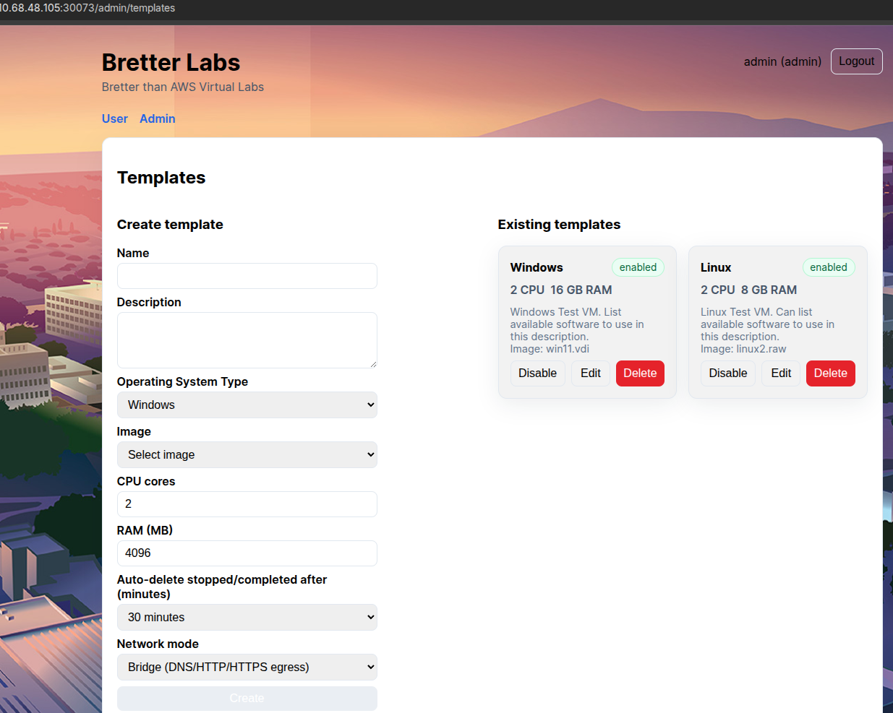
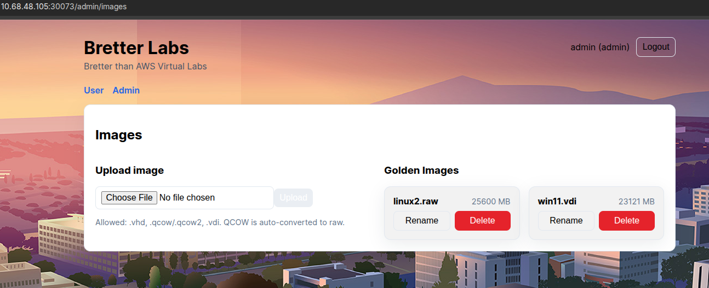
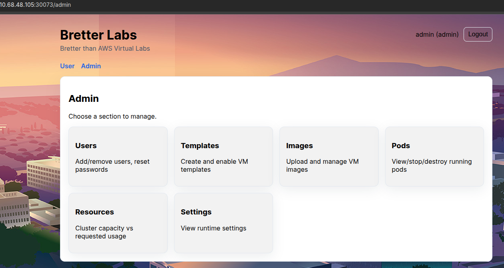
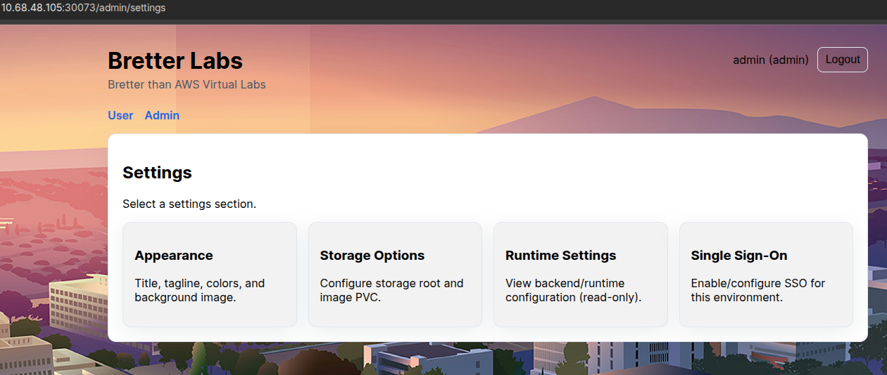
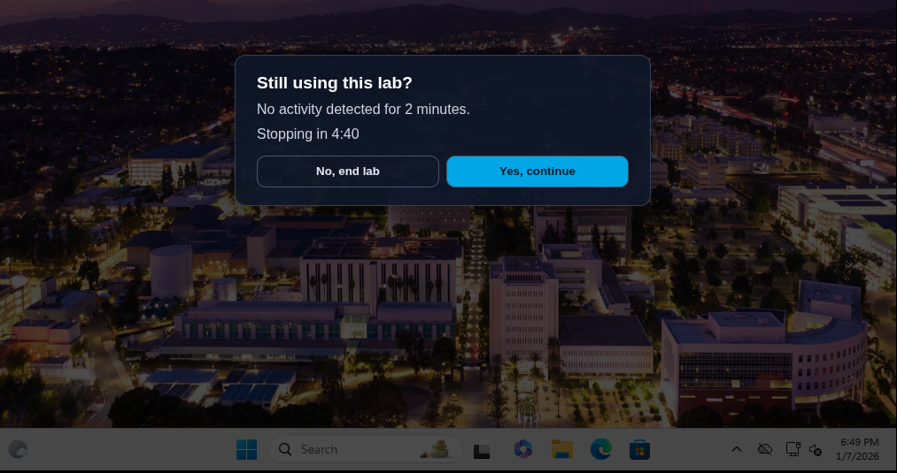

# Bretter Labs

## Description
Bretter Labs is a FastAPI + React (Vite) app for managing Windows/Linux lab VMs on Kubernetes. Admins upload images, define templates, enable/disable labs, manage users, and view cluster resources. Users start labs from templates and connect via SPICE directly in the browser.

## Installation

### Prerequisites
- Python 3.11+ with venv/pip (backend)
- Node.js 18+ with npm (frontend)
- kubectl (to talk to the target cluster)
- docker or podman (optional, for building/pushing images)

### Local development
Backend:
```bash
python3 -m venv .venv
. .venv/bin/activate
pip install -r backend/requirements.txt
uvicorn backend.src.main:app --host 0.0.0.0 --port 8000
```

Frontend:
```bash
cd frontend-vite
npm install
npm run dev -- --host --port 5173
```

### Kubernetes deployment (current setup)
Recommended: use the setup script (auto-installs prerequisites on Ubuntu/Debian).
```bash
./scripts/setup.sh
```

Optional flags:
- `LOAD_LOCAL_IMAGES=1` (default) to build images locally and import them into local containerd.
- `PUSH_IMAGES=1` to build/push images (requires GHCR credentials).
- `CREATE_PULL_SECRET=1` to create/update `ghcr-creds` for private image pulls.
- `BACKEND_IMAGE` / `FRONTEND_IMAGE` to override image tags.
- `RUNNER_IMAGE` to override the VM runner image passed to backend env.
- `NAMESPACE` to override the namespace (default `labs`).
- `KUBECONFIG` to point at a specific kubeconfig.
- `CONTROL_NODE` to pin backend/frontend + hostPath PV affinity to a specific node.
- `NODE_EXTERNAL_HOST` to set backend's advertised NodePort host (defaults to control node ExternalIP/InternalIP).
- `PUBLIC_SCHEME` to set external URL scheme for API/console links (`https` default, set `http` only for non-TLS environments).
- `TLS_ENABLED=1` (default) to ensure a TLS secret exists for backend/frontend/runner.
- `TLS_SECRET_NAME` to set the TLS secret name (default `bretter-tls`).
- `TLS_CERT_FILE` and `TLS_KEY_FILE` to use your own certificate/key when creating the TLS secret.
- `BACKEND_DATA_HOSTPATH` to override backend DB hostPath (default `/var/lib/bretter-labs/backend-data`).
- `GOLDEN_IMAGES_HOSTPATH` to override golden image hostPath (default `/var/lib/bretter-labs/golden-images`).
- `APPLY_GOLDEN_HOSTPATH=1` (default) to create `golden-images` hostPath PV/PVC on control node.
- `APPLY_GOLDEN_PVC=1` to apply `deploy/golden-pvc.yaml` (use this for RWX storage classes).

The script now renders manifests dynamically for namespace/control-node/IP/image values, and applies control-plane tolerations for control-node scheduling.
It also creates a placeholder `ghcr-creds` secret by default so fresh clusters do not fail on a missing imagePullSecret.

If you use prebuilt public images, you can skip local builds with `LOAD_LOCAL_IMAGES=0`. If your registry is private, use `CREATE_PULL_SECRET=1`.

Manual build/push (edit tags as needed):
```bash
podman build -t ghcr.io/csufpsudocromis/bretter-backend:latest -f backend/Dockerfile .
podman push ghcr.io/csufpsudocromis/bretter-backend:latest
podman build -t ghcr.io/csufpsudocromis/bretter-frontend:latest -f frontend-vite/Dockerfile .
podman push ghcr.io/csufpsudocromis/bretter-frontend:latest
```

After build/push, deploy with setup script so placeholders are rendered:
```bash
PUSH_IMAGES=1 CREATE_PULL_SECRET=1 ./scripts/setup.sh
```

Storage and runtime notes:
- `golden-images` PVC stores VM images. By default setup uses `deploy/golden-hostpath.yaml`.
- For shared RWX storage, use `APPLY_GOLDEN_HOSTPATH=0 APPLY_GOLDEN_PVC=1` and set the storage class in `deploy/golden-pvc.yaml`.
- Backend DB uses `backend-data` hostPath on the selected control node.
- Runner image `ghcr.io/csufpsudocromis/win-vm-runner:latest` must be available to containerd on the node(s).

## Usage
- UI: NodePort `30073` (e.g. `https://<node-external-host>:30073`).
- API: NodePort `30080` (e.g. `https://<node-external-host>:30080`).
- Default admin: `admin` / `admin` (forced change on first login).

TLS note:
- `PUBLIC_SCHEME=https` makes frontend/backend URLs and console links use HTTPS/WSS.
- Setup enables TLS on NodePorts by mounting `TLS_SECRET_NAME` into backend/frontend/runner pods.
- If `TLS_CERT_FILE` and `TLS_KEY_FILE` are not provided, setup generates a self-signed cert for `NODE_EXTERNAL_HOST`.

Admin workflow:
- Upload images and create templates (CPU/RAM, idle timeout, enable/disable).
- Manage users, pods, and cluster resources.

User workflow:
- Start a lab from a template.
- Connect via browser SPICE.
- Idle prompts appear in the UI and console; if ignored, labs are auto-stopped/removed.

## License
MIT License. See `LICENSE`.

## Screenshots






