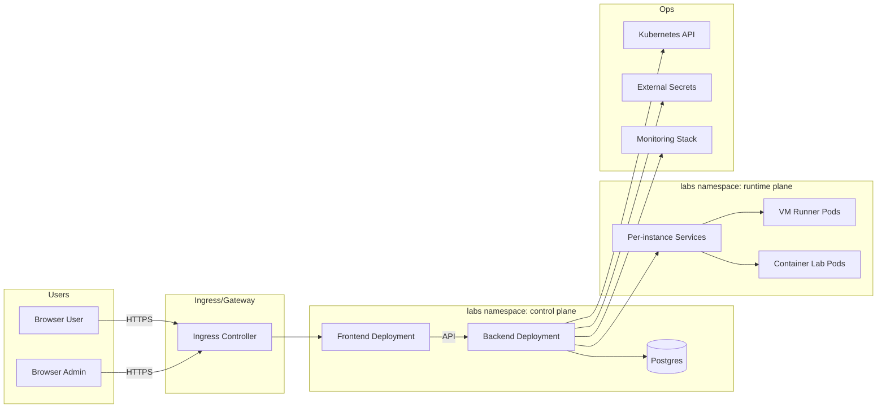

# Production Architecture Reference

Last reviewed: March 9, 2026.

This document defines a production reference architecture for Bretter Labs and answers the core operational questions:

- Where TLS terminates
- What ingress/gateway pattern is expected
- How tenant isolation works
- How secrets are stored
- What database and backup model is expected
- What security boundaries exist between UI/API/runner
- What Kubernetes namespace/SA/network-policy layout is recommended

## Security assumptions

Pick one model explicitly and document it per environment:

1. Internal-only trusted network
   - Campus/private network only
   - Restricted ingress source ranges
   - Internal CA or trusted private cert chain
2. Zero-trust internet-exposed
   - Public ingress with WAF/rate-limiting
   - OIDC + strict session hardening
   - mTLS to selected internal upstreams
   - Tight CIDR policy for console paths

## TLS termination pattern

Recommended:

- Terminate TLS at ingress/gateway.
- Re-encrypt to backend service where practical.
- Keep VM/container connect paths on TLS end-to-end from browser to gateway.

Common deployment modes:

- Edge TLS only (simpler, lower overhead)
- Edge TLS + upstream TLS (stronger defense-in-depth)

## Ingress/gateway pattern

Recommended baseline:

- One ingress controller class for platform traffic
- Host-based routing:
  - `labs.<domain>` -> frontend service
  - API paths proxied to backend service (`/auth`, `/user`, `/admin`)
- Separate connect/proxy routes with longer websocket timeouts
- Optional mTLS on admin/API paths for high-security environments

## Recommended Kubernetes layout

Namespaces:

- `labs` (app and runtime workloads)
- `monitoring` (Prometheus/Grafana/Alertmanager)
- `external-secrets` (if using External Secrets operator)
- `ingress-nginx` (or your ingress namespace)
- Storage/virtualization operator namespaces (`longhorn-system`, `cdi`, etc.)

Service accounts:

- Dedicated SA for backend API (`bretter-backend`)
- Dedicated SA(s) for jobs/operators as needed
- No default SA usage for app workloads in production

Network policies:

- Default-deny ingress/egress at namespace level
- Explicit allow rules:
  - frontend -> backend API
  - backend -> Kubernetes API + DB + runtime services
  - runtime pods -> only required DNS/egress paths

## Tenant isolation model

Recommended:

- Per-namespace quota controls for teams/classes/environments
- Enforce one active lab per user at control plane
- Restrict cross-namespace RBAC access for tenant operators
- Optional per-tenant namespaces for stronger isolation boundaries

## Secrets model

Recommended:

- External secret manager (Vault/enterprise store) via External Secrets
- Kubernetes Secrets as runtime projection only
- No plaintext credentials in git manifests
- Rotate DB/registry credentials on schedule

## Database and backup strategy

Recommended baseline:

- Postgres primary in `labs` namespace (or managed Postgres)
- Daily logical backups + periodic restore test
- PVC snapshots if CSI supports consistent snapshots
- Alembic migrations as the only schema change path

RPO/RTO targets must be defined per environment.

## Security boundaries

Trust boundaries to keep explicit:

- Browser <-> ingress (public edge)
- Frontend <-> backend API (control plane)
- Backend <-> Kubernetes API (orchestration plane)
- Backend <-> Postgres (state plane)
- Backend <-> runtime pods/services (connect/proxy plane)
- Runtime pods <-> external network (egress policy boundary)

## Diagram

## Related

- [Wiki: Hardened Deployment Guide](wiki/Hardened-Deployment-Guide.md)
- [Wiki: Production Helm Values Reference](wiki/Production-Helm-Values-Reference.md)
- [Wiki: Security and Auth](wiki/Security-and-Auth.md)
