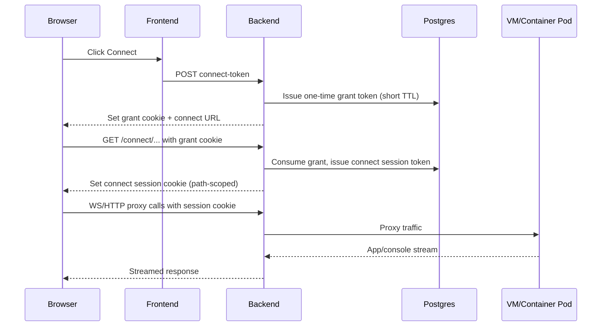

# Connect Flow Deep Dive

Last reviewed: March 9, 2026.

This page explains the VM/container connect path from login to active websocket proxy.

## High-level flow



## Token and cookie behavior

- Auth session cookie: normal app API auth.
- Connect grant cookie:
  - One-time
  - Short TTL
  - Used only to mint connect session
- Connect session cookie:
  - Path-scoped to connect route
  - Required for proxy/ws calls
  - Expires by configured TTL

## Expected endpoints

- VM:
  - `POST /user/pods/{id}/connect-token`
  - `/user/pods/{id}/connect/{proxy_path}`
  - Console target is template-driven:
    - `spice` templates use `/user/pods/{id}/connect/spice-embed.html`
    - `guacamole` templates use `/user/pods/{id}/connect/vnc.html`
    - `guacamole_rdp` templates use `/user/pods/{id}/connect/rdp.html`
- Container:
  - `POST /user/containers/{id}/connect-token`
  - `/user/containers/{id}/connect/{proxy_path}`

## Common failure points

1. Cookie not set/sent (scheme/origin mismatch)
   - Symptom: invalid token/session errors.
2. Grant token expired before first connect request
   - Symptom: connect opens then fails quickly.
3. Connect origin mismatch in postMessage bridge
   - Symptom: repeated "unexpected origin" messages; idle bridge UI issues.
4. Runtime service not ready
   - Symptom: remote disconnected / blank page / connection refused.
5. Session expired during long-running tab
   - Symptom: websocket reconnect loops or auth errors.

## Verification commands

```bash
kubectl -n labs logs deploy/bretter-backend --tail=500 | rg -i 'connect|grant|session|proxy|websocket|origin|invalid'
kubectl -n labs get svc,endpoints | rg 'ctsvc-|vm-|virt-launcher-'
```

## Hardening recommendations

- Keep connect grant TTL short (for example, 120s).
- Enforce HTTPS and secure cookies.
- Restrict origin allowlists to approved domains/LAN ranges.
- Use unique operation IDs and route-level observability for connect APIs.
- Alert on repeated connect proxy failures and websocket handshake errors.

## Related pages

- [Security and Auth](Security-and-Auth)
- [Error Catalog](Error-Catalog)
- [Post-Deploy Validation SOP](Post-Deploy-Validation-SOP)
