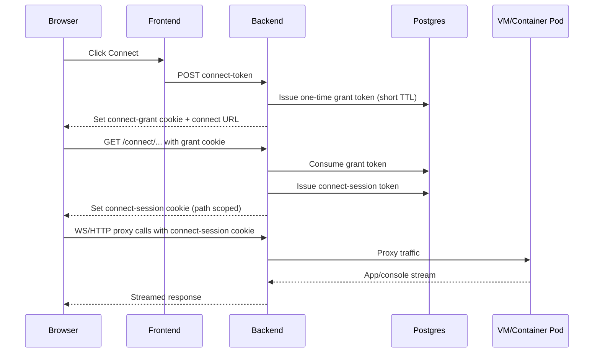

# Connect Flow Deep Dive

Last reviewed: March 19, 2026.

This page describes the connect lifecycle for VM and container labs from UI click to active browser stream.

## High-level flow



## Token and cookie model

Auth/session model:

- Auth cookie (`blabs_session`) is for regular API auth.
- Connect grant cookie (`blabs_connect_grant`) is one-time and short-lived.
- Connect session cookie (`blabs_connect_session`) is path-scoped to connect routes and required for proxy/ws.

Security properties:

- Grant token is one-time use.
- Connect session TTL is server-enforced.
- Stored token values are hashed in DB (plaintext fallback removed).
- Connect cookies follow secure/samesite controls from backend config.

## Endpoint matrix

VM connect:

- `POST /user/pods/{id}/connect-token`
- `GET/WS /user/pods/{id}/connect/{proxy_path}`
- Provider-specific targets:
  - `spice` -> `/user/pods/{id}/connect/spice-embed.html`
  - `guacamole` (VNC) -> `/user/pods/{id}/connect/vnc.html`
  - `guacamole_rdp` -> `/user/pods/{id}/connect/rdp.html`

Container connect:

- `POST /user/containers/{id}/connect-token`
- `GET/WS /user/containers/{id}/connect/{proxy_path}`

## VM console-provider behavior

`spice`:

- Connect URL includes generated SPICE password.
- If password cannot be resolved, backend rejects connect with `409`.

`guacamole` (VNC):

- Browser loads Guacamole VNC HTML client.

`guacamole_rdp`:

- Backend checks `/rdp-ready` on runner before issuing connect token.
- If RDP is not ready, connect-token endpoint returns `409` with:
  - `VM process started; waiting for RDP service.`
- UI keeps VM in `Starting` stage and disables `Connect` until readiness passes.

## Common failure patterns

1. Cookie/scheme mismatch:
   - Symptom: `missing connect token`, `invalid token`, repeated auth prompts.
2. Expired grant token:
   - Symptom: connect opens but fails quickly on first request.
3. Origin mismatch in bridge:
   - Symptom: unexpected origin warnings, connect frame not fully interactive.
4. Upstream service not ready:
   - Symptom: blank screen, `Disconnected`, 502/connection refused.
5. RDP not ready yet (Guacamole RDP):
   - Symptom: connect disabled or `409` wait-for-RDP response.

## Verification commands

```bash
kubectl -n labs logs deploy/bretter-backend --tail=500 | rg -i 'connect|grant|session|proxy|websocket|origin|invalid|rdp-ready'
kubectl -n labs get svc,endpoints | rg 'ctsvc-|vm-|virt-launcher-|svc-'
kubectl -n labs get pods -o wide | rg '^vm-|^virt-launcher-|^ct-'
```

## Hardening checklist

- Keep grant TTL short (for example `120s`).
- Keep HTTPS and secure cookies enabled in production.
- Use explicit CORS allowlist (`CORS_ENTERPRISE_PROFILE=1`).
- Alert on repeated connect proxy failures and websocket handshake errors.

## Related pages

- [Security and Auth](Security-and-Auth)
- [Console Providers and RDP Operations](Console-Providers-and-RDP-Operations)
- [Error Catalog](Error-Catalog)
- [Post-Deploy Validation SOP](Post-Deploy-Validation-SOP)
