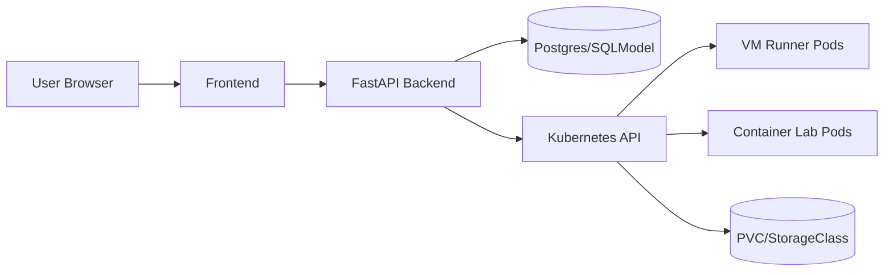

# Bretter Labs Wiki

This folder is the repository source for wiki content.

If you use the GitHub wiki UI, copy these pages to:

- https://github.com/csufpsudocromis/bretter-labs/wiki

## Start here

- [Architecture](../architecture.md)
- [Operations Runbook](Operations-Runbook.md)
- [VM Image Formats](VM-Image-Formats.md)

## Current platform summary

- Kubernetes-native VM and container lab orchestration
- Secure cookie-based auth and connect sessions
- Per-user single active lab enforcement
- Admin visibility for resources, alerts, and capped error logs

## Architecture diagram

