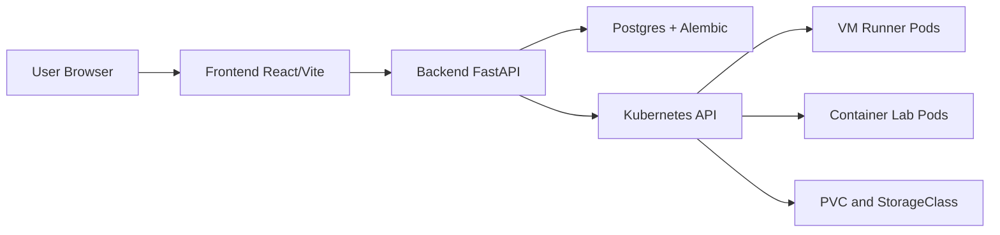

# Bretter Labs Wiki

This folder is the repository source for wiki pages.

GitHub wiki:

- https://github.com/csufpsudocromis/bretter-labs/wiki

Last reviewed: April 3, 2026.

## Audience paths

- Admin setup: [Setup and Configuration](Setup-and-Configuration)
- Operations/SRE: [Operations Runbook](Operations-Runbook)
- Incident triage bundle: [Support Bundle Runbook](Support-Bundle-Runbook)
- Restore/DR ops: [Restore Drill and Backup SOP](Restore-Drill-and-Backup-SOP)
- Secrets/Ops: [Secret Operations Runbook](Secret-Operations-Runbook)
- Alert routing: [Alert Routing and Receiver Defaults](Alert-Routing-and-Receiver-Defaults)
- Troubleshooting: [Error Catalog](Error-Catalog) + [Operations Runbook](Operations-Runbook)
- Websocket/connect triage: [WebSocket Reliability and Diagnostics](WebSocket-Reliability-and-Diagnostics)
- Developer: [Connect Flow Deep Dive](Connect-Flow-Deep-Dive) + [Template Best Practices](Template-Best-Practices)
- Console/RDP operations: [Console Providers and RDP Operations](Console-Providers-and-RDP-Operations)
- Security: [Security and Auth](Security-and-Auth) + [LDAP Authentication](LDAP-Authentication) + [Hardened Deployment Guide](Hardened-Deployment-Guide)
- GitHub/release ops: [GitHub Release and Packages Operations](GitHub-Release-and-Packages-Operations)
- Platform engineering: [Operator/CRD Migration Plan](Operator-CRD-Migration-Plan)
- Operator incidents: [Operator Incident Runbook](Operator-Incident-Runbook)
- CRD evolution: [Operator CRD Versioning Plan](Operator-CRD-Versioning-Plan)
- API contract checks: [API Contract and Drift Guardrails](API-Contract-and-Drift-Guardrails)
- Tenant isolation: [Tenant Isolation and Namespaces](Tenant-Isolation-and-Namespaces)
- Namespace lifecycle/recovery: [Namespace Lifecycle and Recovery](Namespace-Lifecycle-and-Recovery)

## Core pages

- [Architecture](../architecture.md)
- [Production Architecture](Production-Architecture)
- [Operator/CRD Migration Plan](Operator-CRD-Migration-Plan)
- [Operator Incident Runbook](Operator-Incident-Runbook)
- [Operator CRD Versioning Plan](Operator-CRD-Versioning-Plan)
- [Hardened Deployment Guide](Hardened-Deployment-Guide)
- [Production Helm Values Reference](Production-Helm-Values-Reference)
- [Production Readiness Checklist](Production-Readiness-Checklist)
- [Upgrade and Rollback](Upgrade-and-Rollback)
- [Operations Runbook](Operations-Runbook)
- [Support Bundle Runbook](Support-Bundle-Runbook)
- [Alert Routing and Receiver Defaults](Alert-Routing-and-Receiver-Defaults)
- [Restore Drill and Backup SOP](Restore-Drill-and-Backup-SOP)
- [Secret Operations Runbook](Secret-Operations-Runbook)
- [Post-Deploy Validation SOP](Post-Deploy-Validation-SOP)
- [Tenant Isolation and Namespaces](Tenant-Isolation-and-Namespaces)
- [Namespace Lifecycle and Recovery](Namespace-Lifecycle-and-Recovery)
- [Error Catalog](Error-Catalog)
- [Network Modes Reference](Network-Modes-Reference)
- [Storage Capacity Playbook](Storage-Capacity-Playbook)
- [Connect Flow Deep Dive](Connect-Flow-Deep-Dive)
- [WebSocket Reliability and Diagnostics](WebSocket-Reliability-and-Diagnostics)
- [Console Providers and RDP Operations](Console-Providers-and-RDP-Operations)
- [Template Best Practices](Template-Best-Practices)
- [VM Image Formats](VM-Image-Formats)
- [Container Labs](Container-Labs)
- [Scaling and Quotas](Scaling-and-Quotas)
- [Security and Auth](Security-and-Auth)
- [LDAP Authentication](LDAP-Authentication)
- [Community and Roadmap](Community-and-Roadmap)
- [GitHub Release and Packages Operations](GitHub-Release-and-Packages-Operations)
- [Pentest Plan and Checklist](Pentest-Plan-and-Checklist)
- [API Contract and Drift Guardrails](API-Contract-and-Drift-Guardrails)
- [Setup and Configuration](Setup-and-Configuration)

## Production checks at a glance

Use this sequence for every production rollout:

```bash
python3 scripts/validate_production_profile.py --strict \
  -f deploy/helm/values-production.yaml \
  -f deploy/helm/values-prod-site.yaml
NAMESPACE=labs ./scripts/deploy_preflight.sh
./scripts/ci_guardrails.sh
PRODUCTION_PROFILE=1 SETUP_PHASES=deploy,postdeploy ./scripts/setup.sh
NAMESPACE=labs ./scripts/production_go_live_proof.sh
```

Reference pages:

- [Production Helm Values Reference](Production-Helm-Values-Reference)
- [Secret Operations Runbook](Secret-Operations-Runbook)
- [Post-Deploy Validation SOP](Post-Deploy-Validation-SOP)

## Current platform snapshot

- Kubernetes-native VM and container lab orchestration
- Cookie-based auth, short-lived connect grant/session cookies, and enforced session TTL
- RBAC roles and permissions for admin/API paths
- Optional OIDC SSO login flow (authorization code + PKCE)
- Optional LDAP auth fallback configured in `/admin/settings/ldap`
- One active lab per user enforced server-side (VM + container)
- Namespace-based scaling/quota controls in `/admin/settings/namespaces` (legacy aliases `/admin/scaling-quotas` and `/admin/team-quotas` still route to the same view)
- Runtime namespace admission enforcement on launch (quota/limits/network-policy/RBAC contract checks with optional auto-reconcile)
- Namespace switcher in the top header for scoped admin users (`/ns/<namespace>/...`)
- Namespace directory at `/` shows launchable labs and running labs across assigned namespaces
- Namespace selector/catalog APIs (`/admin/template-namespaces`, `/admin/quota-namespaces`) return lab-managed namespaces only and intentionally exclude unrelated system namespaces (`kube-*`, `default`, `cdi`, etc.)
- Backend/frontend autoscaling controls via HPA (`*_HPA_MIN/MAX_REPLICAS`, CPU utilization targets) plus `UVICORN_WORKERS`
- Default ingress NetworkPolicies with explicit app allow rules
- Error log cap/rotation at 10MB with paging (50 entries/page)
- Reusable production baseline values with site-overlay template (`values-production-site.template.yaml`)
- Deploy preflight gate checks merged values, secret wiring, and per-node image pullability
- Automatic production go-live proof in `postdeploy` when `PRODUCTION_PROFILE=1`
- Go-live canary behavior: `RUN_CRD_OPERATOR_CANARY=auto` skips LabInstance canary if `bretter-labinstance-operator` is not deployed/ready; set `RUN_CRD_OPERATOR_CANARY=1` to force strict canary gating
- Post-deploy admin API smoke validation job (`bretter-post-deploy-admin-api-smoke`)
- Recurring GHCR access and user-flow SLO probe CronJobs with Prometheus alert rules
- Secret-backed postdeploy auth checks and RDP connect-latency probe credentials
- Optional encrypted off-cluster backup replication CronJob for production DR (`bretter-postgres-backup-replication`)
- Release-branch smoke gates for post-deploy synthetic, restore drill, and Playwright Guacamole RDP browser checks
- Main-branch userflow smoke gate (`deploy-userflow-smoke.yml`) on push/PR to `main`
- Merge-time image promotion and digest auto-pin workflow on `main` (`publish-and-pin-images.yml`)
- Production deploy workflow for digest-pinned rollouts + go-live proof + drift check (`deploy-production.yml`)
- Staged promotion workflow for staging preflight/go-live gate before production rollout (`promote-staging-to-production.yml`)
- Scheduled/manual live config drift detection against rendered production values (`config-drift-check.yml`, `scripts/check_live_config_drift.py`)
- Staging control-plane failure drill workflow (`staging-failure-drills.yml`, `scripts/failure_drill_control_plane.sh`)
- Branch protection enforcement automation (`enforce-branch-protection.yml`, `scripts/apply_branch_protection.sh`)
- Kind-based tenant impersonation isolation smoke in CI (`scripts/smoke_tenant_isolation_impersonation.sh`)
- Grafana user-flow SLO dashboard ConfigMap pack applied by setup postdeploy
- Dedicated LabImageImport controller with leader-election and metrics endpoints
- Upload-task watchdog retention cleanup for stale terminal tasks (completed/failed) with configurable retention window
- OpenAPI snapshot + frontend API type drift checks in CI guardrails
- Explicit PostgreSQL Alembic migration gate in CI (`scripts/check_alembic_postgres.sh`)
- Tenant isolation audit gate for values/RBAC/network policy posture (`scripts/audit_tenant_isolation.sh`)
- Tenant namespace bootstrap script for namespace quota/policy scaffolding
- Single-cluster multi-node runtime scheduling by default

## Architecture diagram


